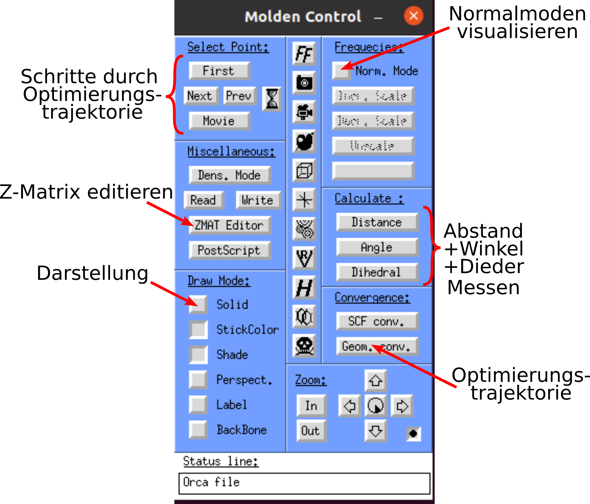
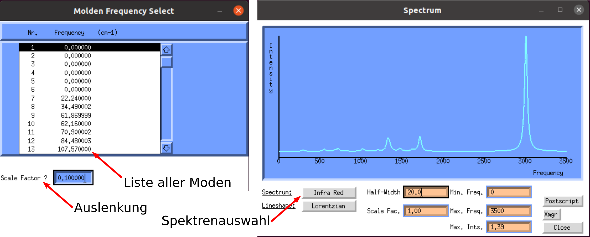

.. include:: symbols.txt

Appendix: Benutzte Programme
============================================

.. contents::

.. _app-IQmol:

IQmol
------

.. _app-molden:

Molden
------

Molden ist ein schnelles Programm um Molekülgeometrien, Optimierungsverläufe oder Schwingungsmoden darzustellen. Es können aber auch Geometrien bearbeitet oder MOs dargestellt werden. Diese kurze Einführung soll einen Überblick über die Möglichkeiten geben. Während des Praktikums soll die Molden-Version in ``home/abt-grimme/AK-bin/molden57`` verwendet werden (kann als Alias in der ``.bashrc`` vermerkt werden, im Folgenden als ``mold`` bezeichnet). Diese erlaubt einige komfortablere Arbeit als die nicht-modifizierte Standardversion. Molden kann entweder für die Inputdatei (``.inp``), eine separate Geometriedatei (``.xyz``) oder die Orca-Outputdatai (``.out``) aufgerufen werden: 

.. code-block:: none   

    mold file

Molden öffnet daraufhin standardmäßig zwei Fenster: das Kontrolfenster (siehe Abbildung :ref:`fig-molden-control`) und das Abbildungsfenster.

.. _fig-molden-control:

    Das zentrale Kontrolfenster von Molden. 

.. admonition:: 1. Geometrieanalyse:

    Zunächsts ist es empfehlenswert die Darstellung auf ``Ball & Stick`` zu ändern um Geometrien besser zu erkennen. Die Bindungsabstände und -winkel sowie Diederwinkel können direkt durch die jeweiligen Optionen gemessen werden. Dafür müssen die gewünschten zwei, drei oder viel Atome in der richtigen Reihenfolge angeklickt werden. Das Ergebnis wird in einem neuen Fenster angezeigt. Die Geometrien können auch in Form der Z-Matrix direkt im ``ZMAT Editor`` bearbeitet werden. 

.. admonition:: 2. Geometrieoptimierung:

    Die Änderung der Geometrie während einer Optimierung kann ebenfalls verfolgt werden. Dazu muss die Orca-Outputdatei oder die ``orca_trj.xyz`` Datei aus einer Optimierung geöffnet werden. Über die ``Next`` und ``Prev`` Optionen kann dann zwischen den Iterationen der Geometrieoptimierung gewechselt werden, oder mit ``Movie`` die ganze Optimierung abgespielt werden. Zusätzlich kann über ``Geom. Conv.`` auch Veränderung der Energie und Gradienten während der Optimierung angezeigt werden. 

.. admonition:: 3. Normalmoden: 

    Die Schwingungsmoden eines Moleküls können über die Option ``Norm. Mode`` angezeigt werden, wenn die Orca-Outputdatei einer Frequenzrechnung geöffnet wird. Dabei öffnet sich ein Fenster für die Auswahl der visualisierten Schwingungsmode sowie ein Fenster mit dem Schwingungsspektrum (siehe Abbildung :ref:`fig-molden-frequency`). Die gewählte Normalmode wird dann im Abbildungsfenster dargestellt. Dabei kann die Auslenkung der Schwingung mit einem Skalierungsfaktor angepasst werden. 

.. _fig-molden-frequency:

    Frequenzauswahl (links) und geplottetes Spektrum (rechts) in Molden. 

.. _app-multiwfn:

Differenzdichten mit MultiWfn
-----------------------------

Multiwfn ist ein Programm zur Analyse von elektronischen Wellenfunktionen. In diesem Praktikum wird es nur eingesetzt um die Differenzdichte zwischen aus zwei .cube Datein an der gleichen Geometrie zu bestimmen, Multiwfn bietet aber darüber hinaus auch eine große Vielfalt anderer Funktionalitäten an (siehe dafür das Manual). Multiwfn kann von der Komandozeile mit dem folgenden Befehl für eine erste Elektronendichte der ``A.cube`` Datei gestartet werden: 

.. code-block:: none   

    multiwfn A.cube

Multiwfn zeigt nun eine ausführliche Auflistung der möglichen Optionen an. Um von der ersten Elektronendichte eine zweite in der ``B.cube`` Datei abzuziehen und die Differenzdichte zu erhalten, braucht es die folgenden Optionen: 

.. code-block:: none   

    13        // Process grid data
    11        // Grid data calculation
    4         // Subtract a grid file                 i.e. A-B=C
    B.cube 
    0         // Output present grid data to Gaussian cube file
    Out.cube

Die fertige Differenzdichte wird damit in die ``Out.cube`` Datei geschrieben. Bei der Berechnung der Differenzdichte ist es wichtig, dass für beide Rechnungen die gleichen Grid-Settings gewählt wurden. 

.. _app-Plot-MO-Dens:

MOs und Dichten mit VMD
-----------------------

.. _app-orca_mapspc:

orca_mapspc
-----------

``orca_mapspc`` ist ein Teil des Orca Programms und ermöglicht das schnelle Plotten verschiedener Spektren ausgehen vom Orca-Outputfile. In diesem Praktikum wird es nur für das Plotten von IR- und Raman-Spektren verwendet. Die Bedienung von ``orca_mapspc`` folgt immer der folgenden Syntax: 

.. code-block:: none   

    orca_mapspc orca.out IR(/RAMAN) -options

Nach dem gewählten Spektrentyp (``IR`` oder ``RAMAN``) können noch weite Optionen, wie die Zahl der Punkte, sowie Anfangs- und Endpunkt etc. festgelegt werden. Mehr Details sind im Orca Manual zu finden. ``orca_mapspc`` produziert als Ausgabe zwei Dateien mit den Endungen ``.stk`` und ``.dat``. In der ``.stk``-Datei sind nochmal die Schwingungsfrequenzen des Moleküls gelistet, während die ``.dat``-Datei das Spektrum als Intensität abhängig von der Frequenzen für die gewählte Anzahl an Punkten beinhaltet. Das Spektrum in der ``.dat``-Datei kann dann mit einem beliebigen Programm (z.B.: GnuPlot, Python oder Excel) aufgetragen werden. 