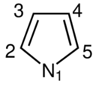
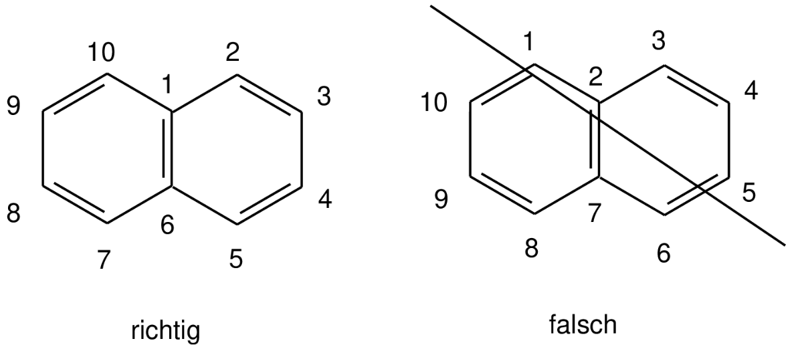
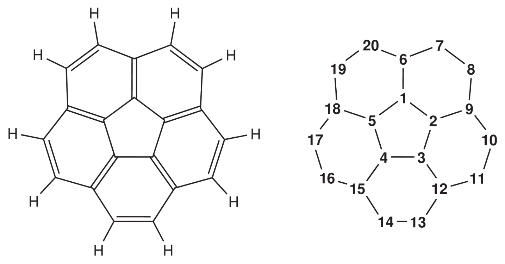
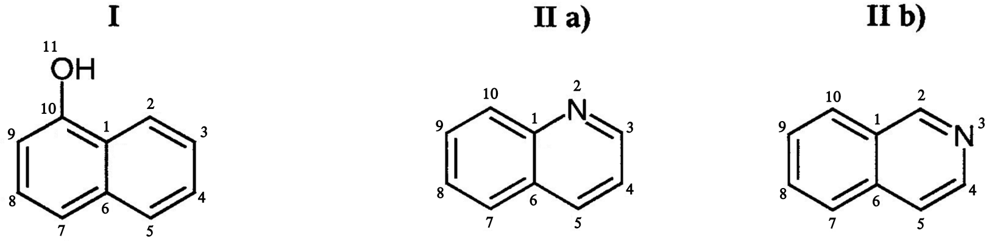
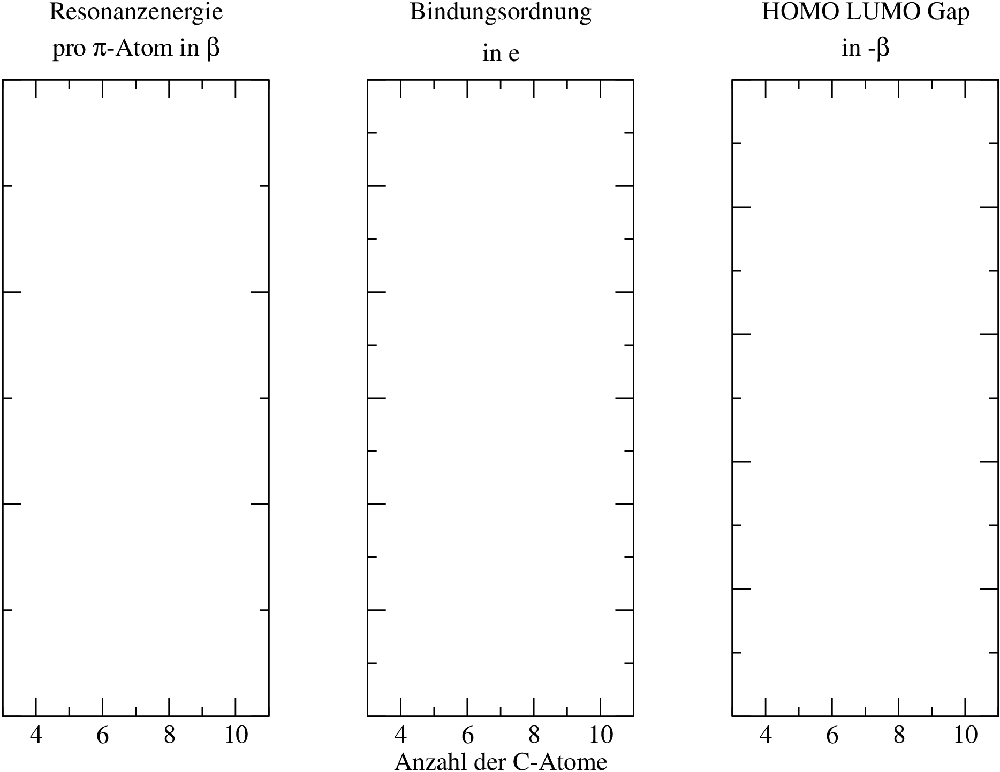
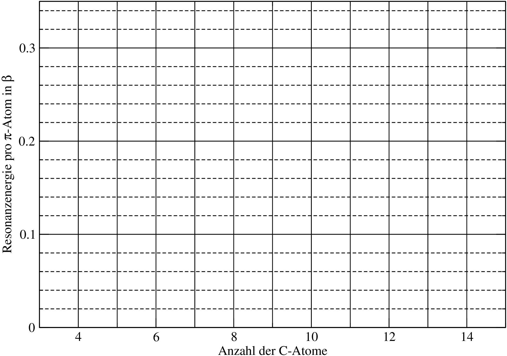
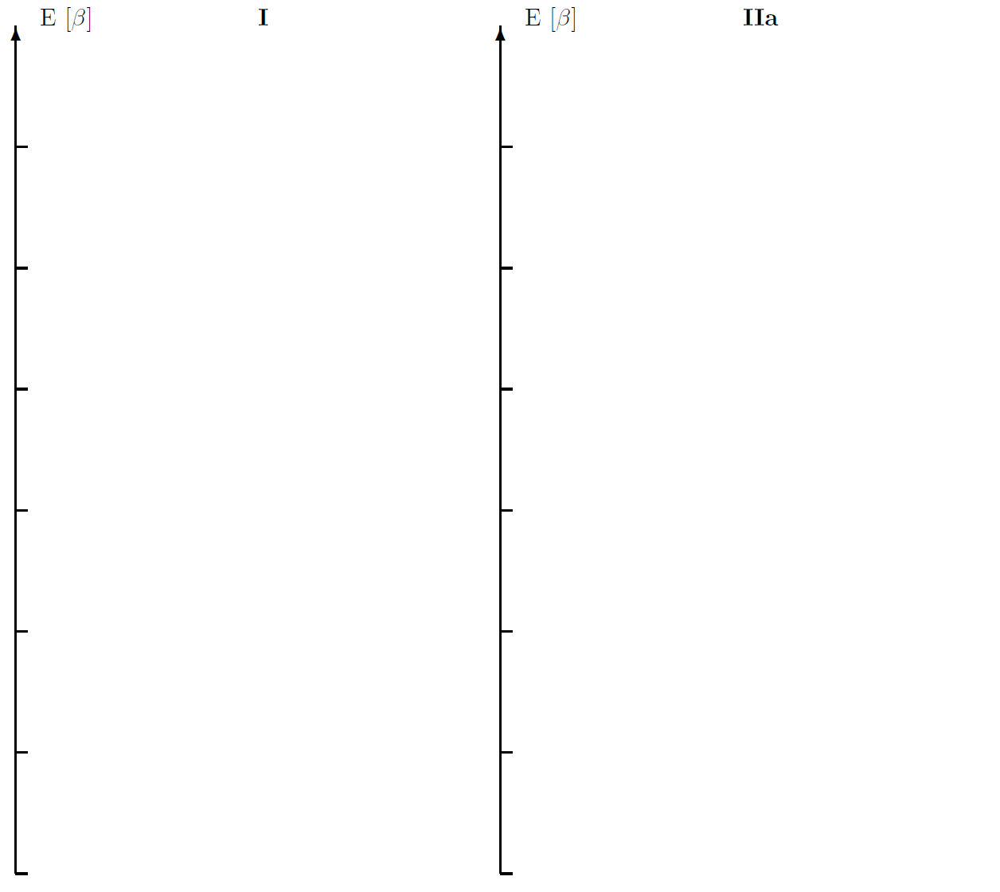
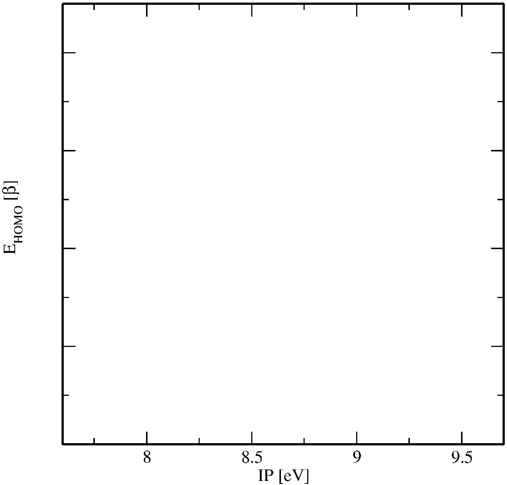

.. include:: symbols.txt

Experiment 1: Hückel-Theorie für |pi|-Elektronensystem (HMO)
============================================================

.. contents::

Die Hückelmethode ist eine der einfachsten semiempirischen Methoden zur quantenchemischen Beschreibung molekularer Systeme. Sie wurde 1931 von E. Hückel zur Berechnung planarer konjugierter Kohlenwasserstoffe entworfen. Eine herausragende historische Bedeutung kommt ihr deshalb zu, weil man - vor allem durch Berücksichtigung der Symmetrieeigenschaften - auf eine aufwendige numerische Behandlung, d.h. Computer, verzichten konnte.

Näherungen in der Hückel-Theorie
--------------------------------

Für planare, konjugierte (d.h. aus :math:`\mathrm{sp}^{2}`-hybridisierten Atomen aufgebaute) Systeme können folgende Näherungen eingeführt werden:

1. Die :math:`\sigma`-Elektronen werden explizit vernachlässigt, d.h. ergeben ein konstantes Potential für alle :math:`\pi`-Elektronen.
2. Für jedes Atom wird nur ein Atomorbital pz in der LCAO-Entwicklung verwendet.
3. Die Überlappungsintegrale werden vernachlässigt für :math:`\mu \neq \nu` (:math:`S_{\mu\mu} = 1`).
4. Die Integrale :math:`H_{\mu\nu}` werden empirisch festgelegt:

(a) :math:`H_{\mu\nu} = \beta`, falls die Atome :math:`\mu` und :math:`\nu` direkt verbunden sind (Energie eines Elektrons im Feld zweier Kerne mit impliziten Korrekturen für vernachlässigte Terme). Sind |mu| und |nu| nicht direkt miteinander verbunden, gilt :math:`H_{\nu\nu} = 0`.
(b) :math:`H_{\nu\nu} = \alpha` (Energie eines Elektrons im Feld des Kerns |mu| mit impliziten Korrekturen für vernachlässigte Terme).

In der Praxis wird :math:`\alpha` für Kohlenstoff willkürlich auf Null gesetzt, und die Parameter anderer Atome werden relativ dazu empirisch bestimmt. :math:`\beta` (Resonanzintegral) wird für eine :math:`\ce{C-C}` Bindung der Länge 1.4 |angst| als Standard auf -1 gesetzt. Bei Molekülen mit starken Abweichungen von dieser Standardlänge oder bei :math:`\ce{C-X}` Bindungen wird der :math:`\beta`-Wert empirisch verändert.

Diskussion der eingeführten Näherungen
--------------------------------------

1.  Die :math:`\sigma`-:math:`\pi`-Separation ist gerechtfertigt, wenn die :math:`\sigma`-Elektronen in guter Näherung für die Reihe zu vergleichender :math:`\pi`-Zustände durch die gleiche Produktfunktion dargestellt werden können, d.h. wenn es innerhalb einer Reihe keine unterschiedlichen  :math:`\sigma`-:math:`\pi` Polarisationseffekte gibt. Behandelt man Aromaten unterschiedlichen Typs, ist diese Annahme jedoch bereits problematisch, da der Einfluss der :math:`\sigma`-Orbitale auf die Stabilität von Aromaten wohl nicht zu vernachlässigen ist. Ähnliches gilt für elektronische Spektren von Aromaten.
2. Bei einfachen Kohlenwasserstoffen ist die Korrelation der Parameter :math:`\alpha` und :math:`\beta` mit experimentellen Größen recht brauchbar. Probleme treten beim Vorhandensein von Heteroatomen, stark polarisierbaren Atomen oder Molekülgruppen oder bei Bindungsstabilisierungseffekten wie Hyperkonjugation auf.

Ladungsordnung und Bindungsordnung
-------------------------------------------
In der Hückeltheorie werden zur Beschreibung der Ladungsverteilung
und der Bindungseigenschaften die Begriffe Ladungsordnung und
Bindungsordnung definiert. Die Ladungsordnung kann mit dem Begriff
der Partialladung in Verbindung gebracht werden. Die Bindungsordnung
ist ein Maß für die Stärke der :math:`\pi`-Bindung zwischen zwei Atomen und
kann sehr gut mit Bindungslängen korreliert werden. Da die Hückel-Orbitalenergie
:math:`\epsilon` durch den folgenden Ausdruck

.. math::
   \epsilon_i=\sum_{r=1}^{M} c^2_{ir}\alpha_r + \sum_{r\ne s} c_{ir}c_{is}\beta_{rs}

gegeben ist (:math:`M` ist die Zahl der :math:`\pi`-Atome bzw. Atomorbitale :math:`p_z`, :math:`c_{ir}` ist der LCAO-Entwicklungskoeffizient des MOs :math:`i` am Atom(orbital) :math:`r`), ergeben sich für Ladungs- und Bindungsordnung die folgenden Ausdrücke:

1. **Ladungsordnung** am Atom :math:`A`

.. math::
   \begin{split}
   q_A \equiv \frac{\partial E}{\partial \alpha_A} &= \sum_{i=1}^{M} n_i \frac{\partial \epsilon_i}{\partial \alpha_A} \\
   &= \sum_{i=1}^{M} n_i \frac{\partial}{\partial \alpha_A}\left(\sum_{r=1}^{M} c^2_{ir}\alpha_r + \sum_{r\ne s} c_{ir}c_{is}\beta_{rs}\right)\\
   &= \sum_{i=1}^{M} n_i |c_{iA}|^2.
   \end{split}

:math:`n_i` ist dabei die Besetzungszahl des MOs :math:`i` (0, 1 oder 2).

Anschaulich summiert man also von allen besetzten MOs (für unbesetzte ist :math:`n_i = 0`) die 
AO-Koeffizienten am Atom :math:`A` auf, so dass eine "Gesamt-:math:`\pi`-Elektronendichte" am 
Atom :math:`A` erhalten wird.

2. **Bindungsordnung** zwischen den Atomen :math:`A` und :math:`B`

.. math::
   \begin{split}
   p_{AB} \equiv \frac{1}{2} \frac{\partial E}{\partial \beta_{AB}} &= \frac{1}{2} \sum_{j=1}^{M} n_j \frac{\partial \epsilon_j}{\partial \beta_{AB}}\\
   &= \frac{1}{2}\sum_{j=1}^{M} n_j \frac{\partial}{\partial \beta_{AB}}(\sum_{r=1}^{M} c^2_{jr}\alpha_r + \sum_{r\ne s} c_{jr}c_{js}\beta_{rs})\\
   &= \sum_{j=1}^{M} n_j c_{jA} c_{jB} 
   \end{split}

Wie erkennbar ist, hat dieser Ausdruck eine große Ähnlichkeit mit der Definition der Ladungsordnung. 
Es wird ebenfalls über alle besetzten MOs summiert. Um eine *Bindungsordnung* zu erhalten, sind die Summanden aber hier Produkte von AO-Koeffizienten benachbarter Atome.

Anleitung: Durchführung einer Hückel-Rechnung
---------------------------------------------

Erstellen Sie zunächst ein Verzeichnis für die Hückelrechnungen (z.B. ``mkdir hueckel``).  
Wechseln Sie in dieses Verzeichnis (``cd hueckel``).  

Erstellen Sie die Eingabedatei mit einem Editor. Die erste Zeile enthält die Anzahl der :math:`\pi`-Atome. In der zweiten Zeile wird die Zahl der :math:`\pi`-Elektronen angegeben. Danach erfolgt die Eingabe der Hückel-Matrix, und zwar zuerst die Nummern der verbundenen Atome gefolgt vom Betrag des Resonanzintegrals :math:`\beta` bzw.\ des Coulombintegrals :math:`\alpha`.

Im Folgenden ist eine Beispieleingabe für Pyrrol angegeben (5 Atome, 6 :math:`\pi`-Elektronen):

.. code-block:: bash

   5
   6
   1 1 0.5
   1 2 0.8
   2 3 1.0
   3 4 1.0
   4 5 1.0
   1 5 0.8

Hinweis: Es wird empfohlen, bei komplizierteren Systemen zuerst eine Skizze des Moleküls anzufertigen,  
die Nummerierung der Atome festzulegen und danach die Hückel-Matrix einzugeben. Für die spätere graphische Betrachtung
muss die Nummerierung der 
Atome fortlaufend entlang der längsten Kette (beginnend bei Brückenkopfatomen, falls vorhanden) erfolgen. 
Es ist darauf zu achten, dass bei Polyzyklen die Brückenkopfatome möglichst niedrige Nummern bekommen.

Nachdem die Matrix gespeichert (z.B. Inputdatei: ``pyr.in``) und der Editor verlassen ist, wird das HMO-Programm mit der Kommandozeile aufgerufen ``hueckel < Inputdatei``
also z.B.:

.. code-block:: bash

   hueckel < pyr.in

Das Programm schreibt die Ergebnisse in den *standard output*, was in der Regel der Bildschirm ist. Um die Ergebnisse zu speichern, muss die Ausgabe in eine Datei umgeleitet werden ``hueckel < Inputdatei > Outputdatei``
also z.B.:

.. code-block:: bash

   ****************************************
         H U E C K E L - PROGRAM
         S. GRIMME, UNI MUENSTER
   ****************************************
   
   NUMBER OF ATOMS ?
   NUMBER OF ELECTRONS ?
   ATOM I, ATOM J, ALPHA/BETA IJ (IN UNITS OF BETA) ?
   STOP WITH -1 -1 -1
   
   MATRIX PRINTED:  HUECKEL-MATRIX
   
         1         2         3         4         5
   
   1   0.50000
   2   0.80000   0.00000
   3   0.00000   1.00000   0.00000
   4   0.00000   0.00000   1.00000   0.00000
   5   0.80000   0.00000   0.00000   1.00000   0.00000
   
   EIGENVALUES
   
   MO NR     :          1         2         3         4         5
   OCCUPATION:         2.0       2.0       2.0       0.0       0.0
   EPSILON   :      1.94464   0.75990   0.61803  -1.20454  -1.61803
   
   MATRIX PRINTED:  HMO-VECTORS
   
         1         2         3         4         5
   
   1   0.47364   0.71279   0.00000   0.51730   0.00000
   2   0.42765   0.11579  -0.60150  -0.55110   0.37175
   3   0.45271  -0.48224  -0.37175   0.24998  -0.60150
   4   0.45271  -0.48224   0.37175   0.24998   0.60150
   5   0.42765   0.11579   0.60150  -0.55110  -0.37175
   
   ALL ENERGETIC QUANTITIES IN UNITS OF BETA!
   
   TOTAL     ENERGY     :    6.645154
   TOTAL     ENERGY/#EL :    1.107526
   RESONANCE ENERGY     :    1.645154
   RESONANCE ENERGY/#EL :    0.274192
   
   MATRIX PRINTED:  CHARGE DENSITY/BOND ORDER MATRIX
   
         1         2         3         4         5
   
   1   1.46480
   2   0.57016   1.11619
   3  -0.25863   0.72274   1.15141
   4  -0.25863  -0.17168   0.59862   1.15141
   5   0.57016  -0.33103  -0.17168   0.72274   1.11619
   
   MINIMUM BOND ORDER BETWEEN BONDED ATOMS  0.5701648900629098
   MAXIMUM BOND ORDER BETWEEN BONDED ATOMS  0.7227442228601404

Nachdem zuerst die Hückelmatrix in Diagonalform angegeben wird, folgt eine Auflistung der Energieeigenwerte der Hückel MO's.
Die Koeffizientenmatrix (``HMO-VECTORS``) enthält die Orbitalkoeffizienten der :math:`\pi`-AO's (:math:`c_{iA}`), 
wobei die MO's die Spalten und die AO's die Zeilen der Matrix bilden.

Die Output-Daten können mit ``viewhuck`` graphisch dargestellt werden. Dies geschieht mit dem Befehl: ``viewhuck Dateiname``, also bspw.

.. code-block:: bash

    viewhuck < pyr.out

Das Programm erzeugt eine Postskript-Datei (``Dateiname.ps``). Diese kann z.B. mit ``okular Dateiname.ps`` geöffnet werden.

Anleitung für das Extended-Hückel Programm EHT
------------------------------------------------

In der EHT Methode werden alle Valenzelektronen der beteiligten Atome betrachtet.
Aus der berechneten Überlappmatrix und atomaren Parametern wird eine Hamiltonmatrix
aufgestellt: :math:`H_{ab} = \frac{1}{2} k (H_{aa}+H_{bb})S_{ab}` und das Eigenwertproblem gelöst.
Für die Durchführung der Rechnung muss daher die Geometrie des Moleküls festgelegt werden.
Erstellen Sie eine Inputdatei mit den Atomkoordinaten im folgenden Format.
In der ersten Zeile muss die Anzahl der Atome stehen. In den folgenden Zeilen stehen die Koordinaten im Format:
``<El> <x> <y> <z>``. Die Koordinaten sind in |angst|.

.. code-block:: bash

    2
    Li 0.0 0.0  0.8
    H  0.0 0.0 -0.5

Starten Sie das Programm mit

.. code-block:: bash

    eht -f <Dateiname>

Sie finden die Energie-Eigenwerte und die Matrix der MO-Koeffizienten (MATRIX PRINTED: occ. MOs), die für die Aufgabe benötigt werden, am Ende des Outputs.
Pro Atom sind vier Basisfunktionen berücksichtigt: :math:`s`, :math:`p_x`, :math:`p_y`, :math:`p_z`.
Die :math:`p`-Orbitale sind wie das Molekül in der Eingabe orientiert, und die Reihenfolge der Atome ist dieselbe wie in der Geometrie-Eingabe.

Aufgaben
--------

Tipp: Machen Sie sich eine Liste der Moleküle, die in mehreren Aufgaben vorkommen.
Speichern Sie für diese Fälle den Input (oder den Output nach erfolgreicher Rechnung)
per Copy/Paste in einer Textdatei, damit Sie die Ergebnisse mehrmals auswerten können.

1. Berechnen Sie die Polyene Butadien, Hexatrien, Octatetraen und
   Decapentaen. Stellen Sie den Verlauf der :math:`\pi`-Elektronenenergie pro
   :math:`\pi`-Atom, den größten und kleinsten Wert für die Bindungsordnung zwischen
   verbundenen Atomen und die Energiedifferenz zwischen HOMO und LUMO
   als Funktion der Kettenlänge dar. Kommentieren Sie kurz Ihre Ergebnisse.

2. Berechnen Sie die Annulene 
   :math:`\rm C_4H_4`,
   :math:`\rm C_5H_5^-`,
   :math:`\rm C_6H_6`,
   :math:`\rm C_7H_7^+`,
   :math:`\rm C_8H_8`,
   :math:`\rm C_{10}H_{10}`,
   :math:`\rm C_{12}H_{12}` und
   :math:`\rm C_{14}H_{14}`. Diskutieren Sie die Ergebnisse im Zusammenhang mit der Hückelregel. (Tragen Sie die Resonanzenergie gegen die Ringgröße auf. Beachten Sie, dass einige Moleküle geladen sind!)

3. Berechnen Sie Phenol (:math:`\alpha_O=2.0`, :math:`\beta_{CO}=0.8`, :math:`N_\pi=8`!) und diskutieren Sie die Ladungsordnungen im Hinblick auf eine mögliche elektrophile aromatische Zweitsubstitution.

4. Berechnen Sie die beiden Kationen, die bei der Protonierung von Naphthalin entstehen können. Geben Sie für beide Kationen die Lewis-Formel (mit Nummerierung der Atome) an. Welches Kation ist stabiler? An welchen Positionen ist eine elektrophile aromatische Substitution begünstigt? Wo ist sie nicht möglich? (für beide Kationen).

5. Berechnen Sie folgende Verbindung und diskutieren Sie die Ladungsordnungen im Zusammenhang mit der Hückelregel. Darf das Molekül mit der Hückel-Methode berechnet werden? Begründen Sie.

6. Führen Sie mit dem Hückel-Programm Rechnungen für die Verbindungen I, IIa und IIb durch.

Das Lone pair des Stickstoffatoms liegt in der Molekülebene.
Eines der Lone pairs des Sauerstoffatoms ist senkrecht zur Molekülebene.
:math:`\alpha_N=0.5`, :math:`\beta_{C-N}=0.8`, :math:`\alpha_O=2.0`, :math:`\beta_{C-O}=0.8`.

a) Welches der beiden Moleküle IIa und IIb ist stabiler?
b) Zeichnen Sie Energiediagramme (Energieniveaus) für die Moleküle I und IIa. Geben Sie die Besetzung der Orbitale an. Markieren Sie HOMO und LUMO.
c) Bilden Sie das LUMO+2 (das dritte LUMO) für die Moleküle I und IIa (mit relativen Größen der Orbitale) ab.
d) Zeigen Sie die stärkste C-C Bindung für die beiden Moleküle I und IIa.
e) Finden Sie die jeweils bevorzugte Kohlenstoffposition für a. elektrophile und b. nukleophile Substitutionen in den Molekülen IIa und IIb.

7. Führen Sie mit dem Hückel-Programm Rechnungen für die in der Tabelle 1.1 aufgeführten aromatischen Kohlenwasserstoffe durch. Tragen Sie die Energie des HOMO gegen die experimentelle Ionisierungsenergie auf. Berechnen Sie die Ausgleichsgrade durch die Wertepaare (lineare Korrelation) und bestimmen Sie daraus den besten Wert für :math:`\beta` nach der Formel

   .. math::
      :label: eq:homo_ip_formula

      E_{\text{HOMO}} = \alpha + \frac{1}{\beta} \mathrm{IP} .

   Erklären Sie die Formel. Was bedeuten :math:`\alpha` und :math:`\beta`?

.. table:: Ionisationspotential für verschiedene Moleküle.
   :align: center

   +-------------------------+------------------+
   | Molekül                 | IP [:math:`eV`]  |
   +=========================+==================+
   | Benzen                  | 9.57             |
   +-------------------------+------------------+
   | Naphthalin              | 8.68             |
   +-------------------------+------------------+
   | Anthracen               | 8.20             |
   +-------------------------+------------------+
   | Phenanthren             | 8.62             |
   +-------------------------+------------------+
   | Tetracen                | 7.71             |
   +-------------------------+------------------+
   | 3,4-Benzophenanthren    | 8.40             |
   +-------------------------+------------------+

8. Führen Sie eine EHT-Rechnung für CO (:math:`r`(C-O) = 1.15 |angst|) durch.
   Zeichnen Sie ein MO-Schema aus den Informationen der MO-Eigenwerte und
   skizzieren Sie die Molekülorbitale, indem Sie die Matrix der MO-Koeffizienten
   am Ende des Outputs auswerten (MATRIX PRINTED: occ. MO-MATRIX).

   Wiederholen Sie die Aufgabe für H\ :sub:`2`\ O und Formaldehyd.
   Verwenden Sie dazu folgende Geometrien:

   * H\ :sub:`2`\ O

   .. code-block:: bash

      3
      O  0.0 0.0 0.0
      H   x   y  0.0
      H   x  -y  0.0

   * CH\ :sub:`2`\ O

   .. code-block:: bash

      4
      C  0.0 0.0 0.0
      O   x  0.0 0.0
      H  -y   z  0.0
      H  -y  -z  0.0

   Berechnen Sie die Werte für x, y und z aus den Angaben zu Bindungslänge und -winkel:

   - R(OH): 0.95
   - R(CO): 1.2
   - R(CH): 1.1
   - W(HOH): 105
   - W(HCH): 120

Protokoll
---------

.. table:: (1.) Polyene
   :align: center

   +----------------------------+-----------------------------------+---------------------------------+---------------------------------+----------------------------------------------+
   | Polyene                    | :math:`E_{res}/π-At.` [:math:`β`] | :math:`max(p_{AB})` [:math:`e`] | :math:`min(p_{AB})` [:math:`e`] | E\ :sub:`HOMO` − E\ :sub:`LUMO` [:math:`-β`] |
   +============================+===================================+=================================+=================================+==============================================+
   | C\ :sub:`4`\ H\ :sub:`6`   |                                   |                                 |                                 |                                              |
   +----------------------------+-----------------------------------+---------------------------------+---------------------------------+----------------------------------------------+
   | C\ :sub:`6`\ H\ :sub:`8`   |                                   |                                 |                                 |                                              |
   +----------------------------+-----------------------------------+---------------------------------+---------------------------------+----------------------------------------------+
   | C\ :sub:`8`\ H\ :sub:`10`  |                                   |                                 |                                 |                                              |
   +----------------------------+-----------------------------------+---------------------------------+---------------------------------+----------------------------------------------+
   | C\ :sub:`10`\ H\ :sub:`12` |                                   |                                 |                                 |                                              |
   +----------------------------+-----------------------------------+---------------------------------+---------------------------------+----------------------------------------------+

.. table:: (2.) Annulene
   :align: center

   +------------------------------------+--------------------------+------------------------------------+----------------------------+------------------------------------+
   | Annulene                           | C\ :sub:`4`\ H\ :sub:`4` | C\ :sub:`5`\ H\ :sub:`5`\ :sup:`-` | C\ :sub:`6`\ H\ :sub:`6`   | C\ :sub:`7`\ H\ :sub:`7`\ :sup:`+` |
   +====================================+==========================+====================================+============================+====================================+
   | :math:`E_{res}/π-At.` [:math:`β`]  |                          |                                    |                            |                                    |
   +------------------------------------+--------------------------+------------------------------------+----------------------------+------------------------------------+
   | Annulene                           | C\ :sub:`8`\ H\ :sub:`8` | C\ :sub:`10`\ H\ :sub:`10`         | C\ :sub:`12`\ H\ :sub:`12` | C\ :sub:`14`\ H\ :sub:`14`         |
   +------------------------------------+--------------------------+------------------------------------+----------------------------+------------------------------------+
   | :math:`E_{res}/π-At.` [:math:`β`]  |                          |                                    |                            |                                    |
   +------------------------------------+--------------------------+------------------------------------+----------------------------+------------------------------------+

.. table:: (3.) Phenol
   :align: center

   +-------------------+-----+---------+---------+---------+---------+
   | Atom              | O   | ipso C  | ortho C | meta C  | para C  |
   +===================+=====+=========+=========+=========+=========+
   | :math:`q_A\ [e]`  |     |         |         |         |         |
   +-------------------+-----+---------+---------+---------+---------+
 

.. table:: (4.) Protoniertes Naphthalin
   :align: center

   +-------------------------------------+-----------------------------------+
   | C\ :sub:`10`\ H\ :sub:`9`\ :sup:`+` | :math:`E_{res}/π-At.` [:math:`β`] |
   +=====================================+===================================+
   | 1                                   |                                   |
   +-------------------------------------+-----------------------------------+
   | 2                                   |                                   |
   +-------------------------------------+-----------------------------------+

.. table:: (5.) Corannulen
   :align: center

   +--------------------+-------------------+-----------------------------+
   | Atom               | 6,9,12,15,18      | 7,8,10,11,13,14,16,17,19,20 |
   +====================+===================+=============================+
   | :math:`q_A\ [e]`   |                   |                             |
   +--------------------+-------------------+-----------------------------+

.. table:: (6a.) 1-Naphthol, Quinolin, Isoquinolin
   :align: center

   +---------------------------------+------------------------------------+
   | C\ :sub:`9`\ H\ :sub:`7`\ N     |  :math:`E_{res}/π-At.` [:math:`β`] |
   +=================================+====================================+
   | IIa                             |                                    |
   +---------------------------------+------------------------------------+
   | IIb                             |                                    |
   +---------------------------------+------------------------------------+
 

6b.) MO-Diagramme

6c.) LUMO+2 Abbildungen

.. table:: (6d.) Bindungsordnungen
   :align: center

   +------+-------+------+-------+
   |  I   | BO.   | IIa  | BO.   |
   +======+=======+======+=======+
   | 2-3  |       | 1-10 |       |
   +------+-------+------+-------+
   | 3-4  |       | 1-2  |       |
   +------+-------+------+-------+
   | 4-5  |       | 2-3  |       |
   +------+-------+------+-------+
   | 5-6  |       | 3-4  |       |
   +------+-------+------+-------+
   | 6-7  |       | 4-5  |       |
   +------+-------+------+-------+
   | 7-8  |       | 5-6  |       |
   +------+-------+------+-------+
   | 8-9  |       | 6-7  |       |
   +------+-------+------+-------+
   | 9-10 |       | 7-8  |       |
   +------+-------+------+-------+
   | 10-11|       | 8-9  |       |
   +------+-------+------+-------+
   | 2-11 |       | 9-10 |       |
   +------+-------+------+-------+
   | 6-11 |       | 4-9  |       |
   +------+-------+------+-------+

.. table:: (6e.) Ionisationspotential für verschiedene Moleküle.
   :align: center

   +-----+-----+-----+
   |     | IIa | IIb |
   +=====+=====+=====+
   | 1   |     |     |
   +-----+-----+-----+
   | 2   |     |     |
   +-----+-----+-----+
   | 3   |     |     |
   +-----+-----+-----+
   | 4   |     |     |
   +-----+-----+-----+
   | 5   |     |     |
   +-----+-----+-----+
   | 6   |     |     |
   +-----+-----+-----+
   | 7   |     |     |
   +-----+-----+-----+
   | 8   |     |     |
   +-----+-----+-----+
   | 9   |     |     |
   +-----+-----+-----+
   | 10  |     |     |
   +-----+-----+-----+

.. table:: (6f.) Ionisierungsenergien
   :align: center

   +---------------------+---------+--------------------+
   |                     | IP (eV) | E\ :sub:`HOMO` (β) |
   +=====================+=========+====================+
   | Benzen              | 9.57    |                    |
   +---------------------+---------+--------------------+
   | Naphthalin          | 8.68    |                    |
   +---------------------+---------+--------------------+
   | Anthracen           | 8.20    |                    |
   +---------------------+---------+--------------------+
   | Phenanthren         | 8.62    |                    |
   +---------------------+---------+--------------------+
   | Tetracen            | 7.71    |                    |
   +---------------------+---------+--------------------+
   | 3,4-Benzophenanthren| 8.40    |                    |
   +---------------------+---------+--------------------+

