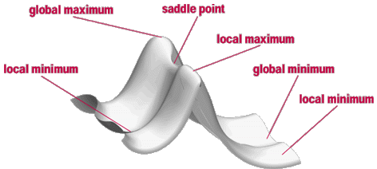

.. include:: symbols.txt

Experiment 3: Geometrieoptimierung
==================================

.. contents::

Hintergrund
-----------
Ziel des Experiments ist es, die stabilste Konfiguration eines Moleküls zu finden.
Für ein zweiatomiges Molekül heißt das, dass bei der Geometrieoptimierung der bestmögliche Abstand zwischen den beiden Atomen gesucht wird.

.. _sec-geom-opt-PES:

Energiehyperfläche (Potential Energy Surface, PES)
---------------------------------------------------
Ein Weg um die Energie eines Systems abhängig von den Koordinaten abzubilden und zu beschreiben ist die Energiehyperfläche oder auch Potential Energy Surface (PES) genannt.
Außer für sehr einfache Systeme ist die Energiehyperfläche sehr kompliziert.
Es ist eine mehrdimensionale Funktion über alle Freiheitsgrade des Moleküls.
Für ein nichtlineares Molekül mit N Atomen ist die Energie eine Funktion von 3N-6 internen Koordinaten.
Deswegen ist es unmöglich die Energiehyperfläche zu visualisieren. 
Nur für sehr einfache Systeme mit ein bis zwei Koordinaten ist eine Darstellung möglich.
Ein Beispiel für eine solche Energiehyperfläche ist in Abbildung :ref:`fig_PES` zu sehen.
Jeder Punkt auf der Energiehyperfläche entspricht einer Anordnung der N Atome im Molekül, also einer möglichen Struktur des Moleküls.
Die Höhe der Oberfläche gibt die Energie dieser Struktur an.

.. _fig_PES:

   Energiehyperfläche eines zweiatomigen Moleküls. Die Energie ist in Einheiten von :math:`E_{\text{min}}` angegeben. Die rote Linie zeigt den Pfad der Geometrieoptimierung.

Auf der Energiehyperfläche sind drei Minima zu sehen. 
Ein Minimum ist der Boden eines Tals auf der Oberfläche, jede Bewegung weg von diesem Punkt führt zu einer Konfiguration mit einer höheren Energie.
Ein Minimum kann klassifiziert werden als `lokales Minimum` oder als `globales Minimum` (die niedrigste Energie auf der gesamten Oberfläche).
Minima stellen eine Gleichgewichtsstruktur des Moleküls dar.
Verschiedene Minima repräsentieren also z.B. verschiedene strukturelle Isomere eines Moleküls oder Edukte und Produkte einer chemischen Reaktion.
Ein Punkt, der ein Maximum in einer Richtung ist und in alle anderen ein Minimum nennt man einen Sattelpunkt oder genauer einen Sattelpunkt erster Ordnung.
Ein Sattelpunkt ist eine Übergangsstruktur zwischen zwei Gleichgewichtsstrukturen oder, um bei Reaktionen zu bleiben, ein Übergangszustand, der Edukte und Produkte verbindet.

.. _sec-geom-opt-minimum:

Suche nach Minima
-----------------

Die Geometrieoptimierung versucht Minima auf der Energiehyperfläche zu finden, welche Gleichgewichtsstrukturen des molekularen Systems entsprechen.
Die Optimierung kann auch Übergangszustände finden.
Für beides, Minima und Sattelpunkte, muss die erste Ableitung der Energie (der Gradient) für alle internen Koordinaten gleich null sein.
Der Gradient ist der negative Wert der Kraft die wirkt, das heißt an einem solchen Punkt ist die wirkende Kraft gleich null.
Punkte an denen der Gradient verschwindet, werden stationäre Punkte genannt. 
Die Energie :math:`E`` eines molekularen Systems ist, unter Berücksichtigung der Born-Oppenheimer-Näherung, eine Funktion der Kern Koordinaten :math:`R`.
Die Energie kann mittels einer Taylorreihe um den Punkt :math:`R^{(k)}`` entwickelt werden.

.. math:: 
    :label: eq-geom-opt-minimum

    E(\vec{R}) =  E(\vec{R}_{0}) + (\vec{R} - \vec{R}_{0})\vec{g}(R_{0}) + (\vec{R} - \vec{R}_{0})^T \mathbf{H}(R_{0})(\vec{R} - \vec{R}_{0}) + ...

Der Gradient ist definiert als:

.. math:: 

    f_i = \left. \frac{\partial E(R)}{\partial R_i} \right|_{R=R^{(k)}}

Die zweiten Ableitungen werden durch die sogenannte Hesse-Matrix :math:`H_{ij}` beschrieben.

.. math:: 

    H_{ij} = \left. \frac{\partial^2 E(R)}{\partial R_i \partial R_j} \right|_{R=R^{(k)}}

Die Funktion der Energie ist in den seltensten Fällen quadratisch.
Somit kann die Taylor-Entwicklung nur als eine grobe Näherung, bekannt als harmonische Näherung (siehe TC1), gesehen werden.
In der Nähe des Minimums ist es möglich die Energiehyperfläche als quadratische Funktion zu nähern.

Um einen stationären Punkt zu finden muss also die erste Ableitung null sein.
Handelt es sich nun um ein Minimum, so sind die zweiten Ableitungen, die Einträge in der Hesse-Matrix, größer als null.
Für einen Sattelpunkt erste Ordnung muss genau eine zweite Ableitung kleiner als null (und alle anderen größer als null) sein.

.. note::
    :class: warning

    Eine Geometrieoptimierung sucht nur nach stationären Punkten! Um zu erfahren ob es sich um ein Minimum oder einen Sattelpunkt handelt muss eine Frequenzrechnung für die optimierte Struktur durchgeführt werden.

Optimierungstechniken
---------------------

Um stationäre Punkte für eine Funktion mit mehreren Variablen zu finden gibt es eine Vielzahl von Methoden.
Hier soll eine kurze Einführung in das verbreitete Newton-Raphson-Verfahren (NR) erfolgen.
In der Nähe eines stationären Punktes kann eine Taylor-Entwicklung für die Energie des Moleküls angesetzt werden.

.. math:: 

    E_{\text{quadr.}}(R) = E(\bar{R}) + (R-\bar{R})f + \frac{1}{2} (R-\bar{R})^T H (R-\bar{R})

Ist :math:`R` nahe genug bei :math:`\bar{R}`, so ist es legitim die exakte Energie :math:`E(R)` durch das quadratische Modell :math:`E_{\text{quadr.}}(R)` zu nähern (harmonische Näherung).
Es ist nun einfach die Energie zu minimieren.
Die erste Ableitung für das Modell der Oberfläche unter Beachtung der internen Koordinaten ist:

.. math::

   \frac{\partial E_{\text{quadr.}}}{\partial R_i} = f_i + \sum\limits_j (R_i - \bar{R_i}) H_{ij}

Nun wird der Schritt-Vektor :math:`\Delta = \bar{R} - R` gelöst.
Dieser bringt uns von Punkt :math:`R` zu dem gesuchten Punkt :math:`\bar{R}`.

.. math::

   \Delta = -H^{-1}f

Diese Gleichung ist essentiell für das NR-Verfahren.
Das NR-Verfahren kann -- für eine quadratische Funktion -- das Minimum in einem Schritt finden.
Für reale Oberflächen, welche nicht quadratisch sind, ist die Konvergenz jedoch langsamer.
Im Allgemeinen gilt, dass die Konvergenz um so länger dauert, je weiter man vom gesuchten Punkt entfernt ist.
Aufgrund der schnellen Konvergenz des NR-Verfahren in der nähe des Minimums wird es gerne genutzt, leider gibt es ein großes Problem in der praktischen Nutzung.
Die Berechnung der Hesse-Matrix ist für große Systeme sehr rechenintensiv.
Deswegen versuchen alle Minimierungsalgorithmen die Berechnung der zweiten Ableitungen zu umgehen.
Anstatt die zweiten Ableitungen in jedem Schritt neu zu berechnen, wird nur mit der Energie und den ersten Ableitungen gearbeitet.
Eine verbreitete Lösung dieses Problems stellt das sogenannte quasi-Newton Verfahren dar.
In diesem Verfahren wird mit einer geratenen (oder einer mit niedriger Genauigkeit berechneten) Hesse-Matrix gestartet.
Diese Matrix wird dann mittels Informationen aus den ersten Ableitungen verbessert.
Wird dies vorsichtig gemacht und war der Startpunkt der Geometrieoptimierung nicht allzu schlecht gewählt, wird die Konvergenz meist nach 10-40 Schritten erreicht, abhängig von der Größe und Natur des Systems.
Generell sind sehr bewegliche Moleküle (flache Energiehyperfläche) schwerer zu optimieren.
Alle Optimierungsverfahren haben mit solchen Systemen Probleme.
Bei solchen Systemen ist es ratsam, in der nähe eines Minimums zu beginnen und die Optimierung genau zu beobachten.

Beschreibung des Experiments
----------------------------

.. admonition:: 1. Geometrieoptimierung

    Führen Sie eine Geometrieoptimierung für die fünf Moleküle aus dem letzten Experiment durch. Verwenden Sie dabei das `TPSS` Funktional und einen `def2-TZVP` Basissatz. Vergleichen Sie die optimierte Struktur mit den experimentellen Daten aus der folgenden Tabelle. Tragen Sie Ihre Ergebnisse in Tabellen ein.
		
.. admonition:: 2. Basissatzeffekt
    
    Führen Sie die Berechnungen mit einem kleinen (`def2-SVP`) und einen größeren Basissatz (`def2-QZVP`) durch. Inwieweit können Sie einen Basissatzeffekt feststellen? Vergleichen Sie dazu zwei sinnvolle Größen, bspw. Gesamtenergie (eV) und Bindungslänge (|angst|).

.. admonition:: 3. Bindungsordnung

    Berechnen Sie die Bindungsordnung für die Moleküle aus dem letzten Experiment. Verwenden Sie dazu die Mayer Bindungsordnung und vergleichen Sie die Ergebnisse mit der chemischen Natur der Bindung. Erstellen Sie zusätzlich Z-Matrizen für Ethan, Ethen und Ethin und optimieren Sie die Geometrien (`TPSS-D4/def2-TZVP`; starten Sie von folgenden geschätzten Bindungslängen: :math:`\ce{C=C}` 1.34 |angst|, und :math:`\ce{C#C}` 1.22 |angst|). Tragen Sie die Bindungsordnung gegen die Bindungslänge für die :math:`\ce{C-C}`-Bindung in :math:`\ce{C2H6}`, :math:`\ce{C2H4}`, und :math:`\ce{C2H2}` auf und beschreiben Sie deren Zusammenhang.

.. csv-table:: Geometrieparameter und Bindungsordnung (Distanz in |angst|, Winkel in °).
   :header: Parameter, Exp., Berechnete Daten, Bindungsordnung, Mayer Bindungsordnung
   :align: center

   :math:`r_{\text{CH}}` in :math:`\ce{CH4}`, 1.094, , ,
   :math:`a_{\text{HCH}}` in :math:`\text{CH}_4`, 109.470, , ,
   :math:`r_{\text{CO}}` in :math:`\text{H}_3\text{COH}`, 1.427, , ,
   :math:`r_{\text{CH}}` in :math:`\text{H}_3\text{COH}`, 1.096, , ,
   :math:`a_{\text{HCH}}` in :math:`\text{H}_3\text{COH}`, 109.030, , ,
   :math:`a_{\text{HOC}}` in :math:`\text{H}_3\text{COH}`, 108.870, , ,
   :math:`d_{\text{HCOH}}` in :math:`\text{H}_3\text{COH}`, 180.000, , ,
   :math:`r_{\text{CO}}` in :math:`\text{CO}_2`, 1.162, , ,
   :math:`a_{\text{OCO}}` in :math:`\text{CO}_2`, 180.000, , ,
   :math:`r_{\text{NH}}` in :math:`\text{NH}_3`, 1.012, , ,
   :math:`a_{\text{HNH}}` in :math:`\text{NH}_3`, 106.670, , ,
   :math:`d_{\text{NH}}` in :math:`\text{NH}_3`, 112.150, , ,
   :math:`r_{\text{OH}}` in :math:`\text{H}_2\text{O}`, 0.958, , ,
   :math:`a_{\text{HOH}}` in :math:`\text{H}_2\text{O}`, 104.480, , ,
