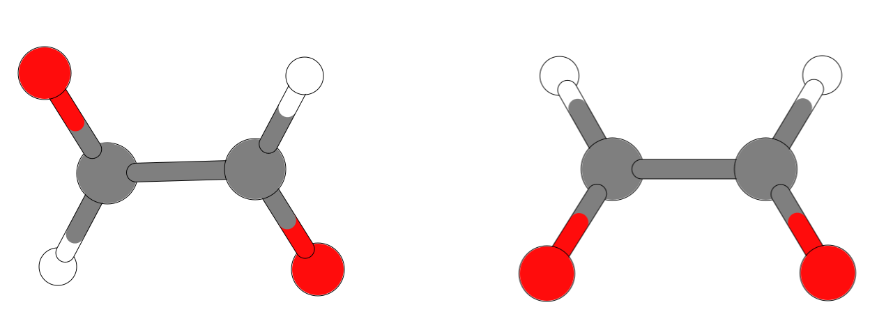
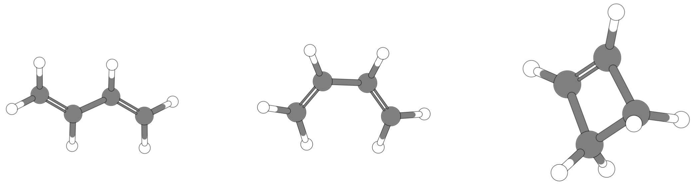

.. include:: symbols.txt

.. _exp_rel_conf:

Experiment 6: Relative Energien von Isomeren
============================================

.. contents::

Hintergrund
-----------

Das Ziel dieses Experiments ist es ein Gefühl für verschiedenen Minima auf einer Energiehyperfläche zu bekommen.

   Zwei Isomere von Glyoxal: trans (links) und cis (rechts).

   Drei Isomere von :math:`\ce{C4H6}`: trans (links), cis (mitte) und Cyclobuten (rechts).

Beschreibung des Experiments
----------------------------

.. admonition:: 1. Vorarbeit

   Verfahren Sie wie in den vorherigen Experimenten. Erstellen Sie die beiden Geometriekonformere von Glyoxal (cis, und trans-) und die drei verschiedenen Konformere/Isomere von Butadien (cis-, trans-) und Cyclobuten. 
   Führen Sie alle Berechnungen mit dem TPSS Funktional durch und nutzten Sie einen TZVP Basissatz.

.. admonition:: 2. Geometrieoptimierung

   Führen Sie eine vollständige Geometrieoptimierung für alle Konformere durch und bestimmen Sie die stationären Punkte auf der Energiehyperfläche. Verwenden Sie dazu auch verschiedene Startgeometrien (verzerren Sie das Molekül).

.. admonition:: 3. Energievergleich

   Wenn Sie die verschiedenen lokalen Minima gefunden haben, vergleichen Sie die relativen Energien von jedem Isomer und tragen Sie die Werte in die Tabelle ein.

.. admonition:: 4. Frequenzrechnung

   Bestimmen Sie, ob es sich bei den stationären Punkten um lokale Minima handelt. Führen Sie dazu eine Frequenzrechnung durch (Schlüsselwort `NumFreq`).

.. admonition:: 5. Diskussion

   Nutzen Sie Ihr chemisches Verständnis um eine Startstruktur in der Nähe des Übergangszustandes zu finden. Finden Sie so mittels Geometrieoptimierung (Schlüsselwort `OptTS`) einen Sattelpunkt erster Ordnung und klassifizieren Sie diesen durch eine Frequenzrechnung. Geben Sie die Diederwinkel aller Strukturen (Minimumsstrukturen und Übergansgeometrien) an.

.. csv-table:: Relative Energien der Isomere von :math:`\ce{C2H2O2}` und :math:`\ce{C4H6}` in kJ/mol.
   :header: "", ":math:`\\ce{C2H2O2}`", ":math:`\\ce{C4H6}`"
   :widths: 10,10,10

   "Trans-", "0", "0"
   "Cis-", "16", "17"
   "Cyclo-", "--", "46"

.. csv-table:: Berechnete Werte in kJ/mol.
   :header: "", ":math:`\\ce{C2H2O2}`", ":math:`\\ce{C4H6}`"
   :widths: 10,10,10

   "Trans-", "", ""
   "Cis-", "", ""
   "Cyclo-", "", ""